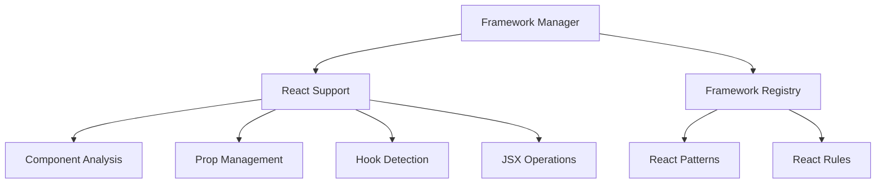

# Framework Integration Guide

## 1. React Integration Architecture



## 2. React Support Implementation

### 2.1 Framework Registration
```typescript
interface FrameworkSupport {
  name: string;
  version: string;
  patterns: FrameworkPattern[];
  rules: FrameworkRule[];
  features: FrameworkFeature[];
}

interface ReactSupport extends FrameworkSupport {
  // Component detection
  detectComponents(uri: string): Promise<ReactComponent[]>;
  
  // Hook analysis
  analyzeHooks(uri: string): Promise<HookUsage[]>;
  
  // Prop management
  analyzeProps(component: ReactComponent): Promise<PropAnalysis>;
  
  // JSX operations
  performJSXOperation(operation: JSXOperation): Promise<EditResult>;
}

const reactSupport: ReactSupport = {
  name: 'react',
  version: '^18.0.0',
  patterns: [
    {
      name: 'functional-component',
      match: {
        kind: 'function',
        returnType: 'JSX.Element'
      }
    },
    {
      name: 'class-component',
      match: {
        kind: 'class',
        extends: 'React.Component'
      }
    }
  ],
  rules: [
    {
      id: 'hook-rules',
      validate: validateHookUsage
    },
    {
      id: 'prop-types',
      validate: validatePropTypes
    }
  ]
};
```

### 2.2 React Component Analysis
```typescript
interface ReactComponent {
  type: 'functional' | 'class';
  name: string;
  props: PropDefinition[];
  hooks: HookUsage[];
  jsx: JSXStructure;
  location: Location;
}

interface PropDefinition {
  name: string;
  type: string;
  required: boolean;
  defaultValue?: string;
  location: Location;
}

interface HookUsage {
  name: string;
  dependencies?: string[];
  location: Location;
}

class ReactAnalyzer {
  async analyzeComponent(uri: string, position: Position): Promise<ReactComponent> {
    // Get component definition through LSP
    const [definition] = await this.connection.sendRequest(
      'textDocument/definition',
      { textDocument: { uri }, position }
    );
    
    // Get symbol information
    const symbol = await this.getSymbolAtLocation(definition);
    
    // Analyze component structure
    return {
      type: this.getComponentType(symbol),
      name: symbol.name,
      props: await this.analyzeProps(symbol),
      hooks: await this.analyzeHooks(symbol),
      jsx: await this.analyzeJSX(symbol),
      location: definition
    };
  }
  
  private async analyzeProps(symbol: DocumentSymbol): Promise<PropDefinition[]> {
    // Find prop type definitions
    const propTypes = await this.findPropTypes(symbol);
    
    // Analyze each prop
    return Promise.all(
      propTypes.map(async prop => ({
        name: prop.name,
        type: await this.getTypeInfo(prop),
        required: !prop.optional,
        defaultValue: await this.findDefaultValue(prop),
        location: prop.location
      }))
    );
  }
}
```

### 2.3 React Edit Operations
```typescript
type ReactEditOperation =
  | AddPropOperation
  | UpdatePropOperation
  | AddHookOperation
  | WrapWithMemoOperation
  | AddEffectOperation;

interface AddPropOperation {
  type: 'add-prop';
  component: string;
  prop: {
    name: string;
    type: string;
    required?: boolean;
    defaultValue?: string;
  };
}

interface AddHookOperation {
  type: 'add-hook';
  hook: {
    name: string;
    dependencies?: string[];
    initialization?: string;
  };
}

// Example operations
const editOperations: ReactEditOperation[] = [
  {
    type: 'add-prop',
    component: 'Button',
    prop: {
      name: 'variant',
      type: "'primary' | 'secondary'",
      required: true
    }
  },
  {
    type: 'add-hook',
    hook: {
      name: 'useState',
      initialization: 'const [isLoading, setIsLoading] = useState(false)'
    }
  }
];
```

## 3. Example React Operations

### 3.1 Add TypeScript Props
```typescript
// Target component and add prop
await editor.applyTargetedEdit({
  target: {
    type: 'component',
    name: 'Button',
    framework: 'react'
  },
  operation: {
    type: 'add-prop',
    content: `
interface ButtonProps {
  variant?: 'primary' | 'secondary';
  size?: 'small' | 'medium' | 'large';
  disabled?: boolean;
  onClick?: () => void;
}
    `.trim()
  }
});

// Add prop to existing interface
await editor.applyTargetedEdit({
  target: {
    type: 'interface',
    name: 'ButtonProps'
  },
  operation: {
    type: 'add-property',
    content: 'loading?: boolean'
  }
});
```

### 3.2 Add React Hooks
```typescript
// Add useState hook
await editor.applyTargetedEdit({
  target: {
    type: 'component-body',
    name: 'UserProfile'
  },
  operation: {
    type: 'add-hook',
    hook: {
      name: 'useState',
      initialization: 'const [isLoading, setIsLoading] = useState(false)',
      position: 'start'
    }
  }
});

// Add useEffect hook
await editor.applyTargetedEdit({
  target: {
    type: 'component-body',
    name: 'UserProfile'
  },
  operation: {
    type: 'add-hook',
    hook: {
      name: 'useEffect',
      content: `
useEffect(() => {
  fetchUserData();
}, [userId]);
      `.trim(),
      position: 'after-state'
    }
  }
});
```

### 3.3 Modify JSX Structure
```typescript
// Add JSX element
await editor.applyTargetedEdit({
  target: {
    type: 'jsx-element',
    tagName: 'div',
    props: { className: 'container' }
  },
  operation: {
    type: 'append-child',
    content: '<LoadingSpinner size="medium" />'
  }
});

// Update JSX props
await editor.applyTargetedEdit({
  target: {
    type: 'jsx-element',
    tagName: 'Button'
  },
  operation: {
    type: 'update-props',
    props: {
      variant: 'primary',
      size: 'large',
      'data-testid': 'submit-button'
    }
  }
});
```

### 3.4 Add Error Boundaries
```typescript
// Wrap component with error boundary
await editor.applyTargetedEdit({
  target: {
    type: 'component',
    name: 'UserProfile'
  },
  operation: {
    type: 'wrap-with-error-boundary',
    content: {
      import: "import { ErrorBoundary } from '@/components/ErrorBoundary';",
      wrapper: {
        before: '<ErrorBoundary fallback={<ErrorFallback />}>',
        after: '</ErrorBoundary>'
      }
    }
  }
});
```

## 4. Framework Feature Detection

```typescript
interface FrameworkDetector {
  detectFramework(uri: string): Promise<FrameworkInfo>;
  detectFeatures(uri: string): Promise<FrameworkFeature[]>;
}

class ReactDetector implements FrameworkDetector {
  async detectFramework(uri: string): Promise<FrameworkInfo> {
    // Check package.json
    const dependencies = await this.getDependencies();
    
    // Check imports
    const imports = await this.getImports(uri);
    
    // Check JSX usage
    const hasJSX = await this.hasJSXSyntax(uri);
    
    return {
      name: 'react',
      version: dependencies.react,
      features: {
        typescript: true,
        hooks: true,
        jsx: true
      }
    };
  }
  
  async detectFeatures(uri: string): Promise<FrameworkFeature[]> {
    const features: FrameworkFeature[] = [];
    
    // Detect TypeScript
    if (await this.hasTypeScriptConfig()) {
      features.push('typescript');
    }
    
    // Detect hooks usage
    if (await this.hasHooksUsage(uri)) {
      features.push('hooks');
    }
    
    // Detect component patterns
    if (await this.hasClassComponents(uri)) {
      features.push('class-components');
    }
    
    return features;
  }
}
```

## 5. Framework Validation

```typescript
interface FrameworkValidator {
  validateComponent(component: ReactComponent): Promise<Diagnostic[]>;
  validateHooks(hooks: HookUsage[]): Promise<Diagnostic[]>;
  validateProps(props: PropDefinition[]): Promise<Diagnostic[]>;
}

class ReactValidator implements FrameworkValidator {
  async validateComponent(component: ReactComponent): Promise<Diagnostic[]> {
    const diagnostics: Diagnostic[] = [];
    
    // Validate hooks rules
    if (component.type === 'functional') {
      diagnostics.push(...await this.validateHooks(component.hooks));
    }
    
    // Validate prop types
    diagnostics.push(...await this.validateProps(component.props));
    
    // Validate JSX structure
    diagnostics.push(...await this.validateJSX(component.jsx));
    
    return diagnostics;
  }
  
  private async validateHooks(hooks: HookUsage[]): Promise<Diagnostic[]> {
    // Check hooks rules
    // - Only called at top level
    // - Only called in React functions
    // - Dependencies array correctness
    return this.checkHookRules(hooks);
  }
}
```
