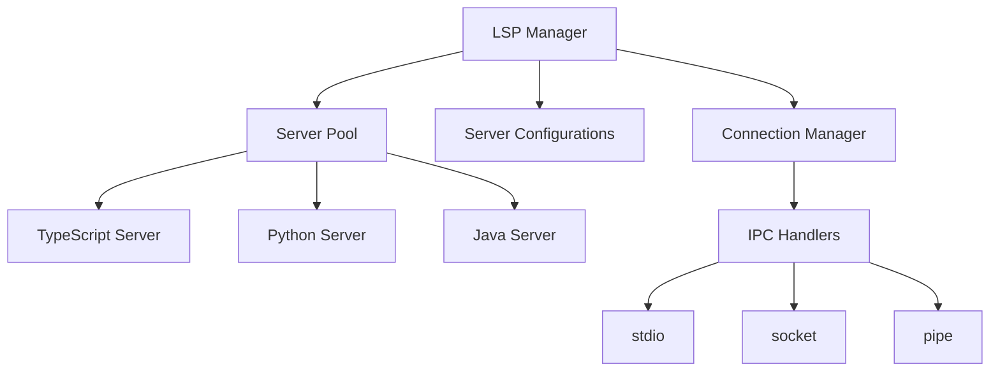

# Language Server Integration Guide

## 1. Language Server Overview



## 2. Supported Language Servers

### 2.1 TypeScript/JavaScript
```json
{
  "dependencies": {
    "typescript-language-server": "^3.3.2",
    "typescript": "^5.0.4",
    "@types/node": "^18.15.11"
  },
  "serverConfig": {
    "command": "typescript-language-server",
    "args": ["--stdio"],
    "settings": {
      "typescript": {
        "format": {
          "semicolons": true,
          "tabSize": 2
        },
        "suggest": {
          "completeFunctionCalls": true
        },
        "inlayHints": {
          "parameterNames": true
        }
      }
    }
  }
}
```

### 2.2 Python
```json
{
  "dependencies": {
    "pyright": "^1.1.308",
    "python-language-server": "^0.2.38"
  },
  "serverConfig": {
    "command": "pyright-langserver",
    "args": ["--stdio"],
    "settings": {
      "python": {
        "analysis": {
          "typeCheckingMode": "basic",
          "autoSearchPaths": true
        },
        "formatting": {
          "provider": "black"
        }
      }
    }
  }
}
```

### 2.3 Java
```json
{
  "dependencies": {
    "java-language-server": "^0.2.38",
    "eclipse.jdt.ls": "^1.9.0"
  },
  "serverConfig": {
    "command": "jdtls",
    "args": [
      "-data",
      "${workspaceFolder}"
    ],
    "settings": {
      "java": {
        "format": {
          "settings": {
            "url": ".settings/formatter.xml"
          }
        },
        "completion": {
          "importOrder": [
            "java",
            "javax",
            "com",
            "org"
          ]
        }
      }
    }
  }
}
```

## 3. Integration Implementation

### 3.1 LSP Server Manager
```typescript
interface LSPServerConfig {
  command: string;
  args: string[];
  settings: Record<string, any>;
  initializationOptions?: Record<string, any>;
  workspaceConfig?: Record<string, any>;
}

class LSPServerManager {
  private servers = new Map<string, LanguageServer>();
  private configs = new Map<string, LSPServerConfig>();
  
  // Register server configuration
  registerServer(language: string, config: LSPServerConfig) {
    this.configs.set(language, config);
  }
  
  // Start server instance
  async startServer(language: string): Promise<LanguageServer> {
    const config = this.configs.get(language);
    if (!config) throw new Error(`No config for ${language}`);
    
    const server = new LanguageServer(config);
    await server.initialize();
    
    this.servers.set(language, server);
    return server;
  }
  
  // Get or create server instance
  async getServer(language: string): Promise<LanguageServer> {
    let server = this.servers.get(language);
    if (!server) {
      server = await this.startServer(language);
    }
    return server;
  }
}
```

### 3.2 Language Server Implementation
```typescript
class LanguageServer {
  private connection: Connection;
  private documents: TextDocuments<TextDocument>;
  
  constructor(private config: LSPServerConfig) {
    this.documents = new TextDocuments(TextDocument);
    this.connection = this.createConnection();
  }
  
  private createConnection(): Connection {
    // Create server process
    const serverProcess = spawn(
      this.config.command,
      this.config.args,
      {
        stdio: ['pipe', 'pipe', 'pipe']
      }
    );
    
    // Create LSP connection
    return createConnection(
      new StreamMessageReader(serverProcess.stdout),
      new StreamMessageWriter(serverProcess.stdin)
    );
  }
  
  async initialize(): Promise<void> {
    // Initialize connection
    const result = await this.connection.initialize({
      capabilities: {
        textDocument: {
          synchronization: {
            dynamicRegistration: true,
            willSave: true,
            willSaveWaitUntil: true,
            didSave: true
          },
          completion: {
            dynamicRegistration: true,
            completionItem: {
              snippetSupport: true
            }
          },
          // Add other capabilities...
        },
        workspace: {
          workspaceFolders: true,
          configuration: true
        }
      },
      initializationOptions: this.config.initializationOptions,
      workspaceFolders: null
    });
    
    // Configure server
    await this.connection.workspace.configuration({
      items: [{
        section: this.config.settings
      }]
    });
  }
}
```

### 3.3 Language-Specific Handlers

```typescript
class TypeScriptServer extends LanguageServer {
  // TypeScript-specific functionality
  async findReferences(uri: string, position: Position): Promise<Location[]> {
    return this.connection.sendRequest('textDocument/references', {
      textDocument: { uri },
      position,
      context: { includeDeclaration: true }
    });
  }
  
  async getTypeDefinition(uri: string, position: Position): Promise<Location[]> {
    return this.connection.sendRequest('textDocument/typeDefinition', {
      textDocument: { uri },
      position
    });
  }
}

class PythonServer extends LanguageServer {
  // Python-specific functionality
  async findImports(uri: string): Promise<SymbolInformation[]> {
    return this.connection.sendRequest('python/findImports', {
      textDocument: { uri }
    });
  }
  
  async getVirtualEnv(): Promise<string> {
    return this.connection.sendRequest('python/getVirtualEnv');
  }
}
```

### 3.4 Document Synchronization
```typescript
interface DocumentSync {
  // Open document
  openDocument(uri: string, languageId: string): Promise<void>;
  
  // Update document
  updateDocument(uri: string, changes: TextDocumentContentChangeEvent[]): Promise<void>;
  
  // Close document
  closeDocument(uri: string): Promise<void>;
}

class LSPDocumentSync implements DocumentSync {
  constructor(private server: LanguageServer) {}
  
  async openDocument(uri: string, languageId: string): Promise<void> {
    await this.server.connection.sendNotification('textDocument/didOpen', {
      textDocument: {
        uri,
        languageId,
        version: 1,
        text: ''
      }
    });
  }
  
  async updateDocument(
    uri: string,
    changes: TextDocumentContentChangeEvent[]
  ): Promise<void> {
    await this.server.connection.sendNotification('textDocument/didChange', {
      textDocument: {
        uri,
        version: 2
      },
      contentChanges: changes
    });
  }
}
```

## 4. Advanced Features

### 4.1 Workspace Management
```typescript
interface WorkspaceManager {
  // Add workspace folder
  addWorkspaceFolder(uri: string): Promise<void>;
  
  // Configure workspace
  configureWorkspace(settings: WorkspaceConfiguration): Promise<void>;
  
  // Watch files
  watchFiles(globPattern: string): Promise<void>;
}
```

### 4.2 Diagnostic Management
```typescript
interface DiagnosticManager {
  // Get diagnostics
  getDiagnostics(uri: string): Promise<Diagnostic[]>;
  
  // Subscribe to diagnostics
  subscribeToDiagnostics(
    callback: (uri: string, diagnostics: Diagnostic[]) => void
  ): void;
  
  // Clear diagnostics
  clearDiagnostics(uri: string): Promise<void>;
}
```

## 5. Error Handling

```typescript
class LSPError extends Error {
  constructor(
    message: string,
    public code: number,
    public data?: any
  ) {
    super(message);
    this.name = 'LSPError';
  }
}

interface ErrorHandler {
  // Handle connection errors
  handleConnectionError(error: Error): void;
  
  // Handle request errors
  handleRequestError(error: ResponseError<any>): void;
  
  // Handle server errors
  handleServerError(error: Error): void;
}
```

## 6. Server Lifecycle Management

```typescript
interface ServerLifecycle {
  // Start server
  start(): Promise<void>;
  
  // Stop server
  stop(): Promise<void>;
  
  // Restart server
  restart(): Promise<void>;
  
  // Check server health
  checkHealth(): Promise<boolean>;
}
```

## 7. Server-Specific Optimizations

### 7.1 TypeScript Server
```typescript
interface TypeScriptOptimizations {
  // Project configuration
  configureProject(tsconfig: any): Promise<void>;
  
  // Module resolution
  configureModuleResolution(options: ModuleResolutionOptions): Promise<void>;
  
  // Performance settings
  configurePerformance(options: PerformanceOptions): Promise<void>;
}
```

### 7.2 Python Server
```typescript
interface PythonOptimizations {
  // Virtual environment
  configureVirtualEnv(path: string): Promise<void>;
  
  // Import resolution
  configurePythonPath(paths: string[]): Promise<void>;
  
  // Stub generation
  configureStubGeneration(options: StubOptions): Promise<void>;
}
```

## 8. Testing Strategy

```typescript
describe('Language Server Integration', () => {
  let server: LanguageServer;
  
  beforeEach(async () => {
    server = await serverManager.startServer('typescript');
  });
  
  afterEach(async () => {
    await server.stop();
  });
  
  it('should initialize server', async () => {
    const capabilities = await server.getCapabilities();
    expect(capabilities.textDocumentSync).toBeDefined();
  });
  
  it('should handle document changes', async () => {
    await server.openDocument('file:///test.ts', 'typescript');
    const diagnostics = await server.getDiagnostics('file:///test.ts');
    expect(diagnostics).toBeDefined();
  });
});
```