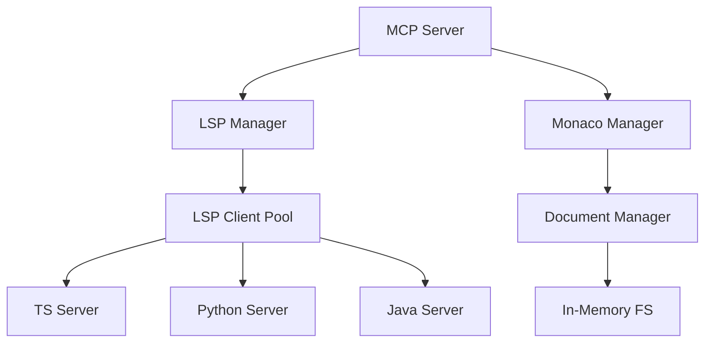

# Headless Code Editor MCP Server - LSP Architecture

## 1. Core Architecture



## 2. Required Dependencies

```json
{
  "dependencies": {
    // LSP Core
    "vscode-languageserver": "^8.1.0",
    "vscode-languageserver-textdocument": "^1.0.8",
    "vscode-languageserver-protocol": "^3.17.3",
    
    // Monaco Editor Core
    "@monaco-editor/node": "^0.4.0",
    "monaco-editor-core": "^0.36.1",
    
    // File System
    "memfs": "^4.2.0",
    "graceful-fs": "^4.2.11",
    
    // Language Servers
    "typescript-language-server": "^3.3.2",
    "pyright": "^1.1.308",
    "java-language-server": "^0.2.38",
    
    // MCP Protocol
    "@modelcontextprotocol/sdk": "^0.6.0",
    
    // Utilities
    "vscode-uri": "^3.0.7",
    "node-pty": "^1.0.0",
    "chokidar": "^3.5.3"
  },
  "devDependencies": {
    "@types/node": "^18.15.11",
    "@types/vscode": "^1.77.0",
    "typescript": "^5.0.4"
  }
}
```

## 3. Core Components

### 3.1 LSP Manager
```typescript
interface LSPManager {
  // Start LSP server for a language
  startServer(language: string): Promise<LSPConnection>;
  
  // Get existing server connection
  getServer(language: string): LSPConnection | undefined;
  
  // Stop server
  stopServer(language: string): Promise<void>;
  
  // Get server capabilities
  getCapabilities(language: string): ServerCapabilities;
}

class LSPManagerImpl implements LSPManager {
  private servers = new Map<string, LSPConnection>();
  private configs = new Map<string, LSPConfig>();
  
  constructor() {
    // Register default configs
    this.configs.set('typescript', {
      serverPath: require.resolve('typescript-language-server'),
      serverArgs: ['--stdio'],
      workspaceConfig: {
        typescript: {
          format: { semicolons: true },
          suggest: { completeFunctionCalls: true }
        }
      }
    });
    // Add other language configs...
  }
  
  async startServer(language: string): Promise<LSPConnection> {
    const config = this.configs.get(language);
    if (!config) throw new Error(`No LSP config for ${language}`);
    
    const connection = await this.createServerConnection(config);
    this.servers.set(language, connection);
    return connection;
  }
}
```

### 3.2 Document Manager
```typescript
interface DocumentManager {
  // Open document
  openDocument(uri: string): Promise<TextDocument>;
  
  // Get document
  getDocument(uri: string): TextDocument | undefined;
  
  // Apply edits
  applyEdit(uri: string, edit: TextEdit): Promise<void>;
  
  // Get Monaco model
  getModel(uri: string): monaco.editor.ITextModel;
  
  // Validate document
  validate(uri: string): Promise<Diagnostic[]>;
}

class DocumentManagerImpl implements DocumentManager {
  private documents = new Map<string, TextDocument>();
  private models = new Map<string, monaco.editor.ITextModel>();
  
  async openDocument(uri: string): Promise<TextDocument> {
    // Create text document
    const document = TextDocument.create(uri, 'typescript', 1, '');
    
    // Create Monaco model
    const model = monaco.editor.createModel('', 'typescript');
    
    this.documents.set(uri, document);
    this.models.set(uri, model);
    
    return document;
  }
}
```

### 3.3 Edit Operations Manager
```typescript
interface EditOperationsManager {
  // Apply targeted edit
  applyTargetedEdit(params: {
    uri: string;
    target: CodeTarget;
    operation: EditOperation;
  }): Promise<EditResult>;
  
  // Resolve target to locations
  resolveTarget(uri: string, target: CodeTarget): Promise<Location[]>;
  
  // Validate edit
  validateEdit(uri: string, edit: TextEdit): Promise<Diagnostic[]>;
}

class EditOperationsManagerImpl implements EditOperationsManager {
  constructor(
    private lspManager: LSPManager,
    private documentManager: DocumentManager
  ) {}
  
  async applyTargetedEdit(params: {
    uri: string;
    target: CodeTarget;
    operation: EditOperation;
  }): Promise<EditResult> {
    // 1. Resolve target
    const locations = await this.resolveTarget(params.uri, params.target);
    
    // 2. Create edit operations
    const edits = this.createEdits(locations, params.operation);
    
    // 3. Apply edits
    await this.documentManager.applyEdit(params.uri, edits);
    
    // 4. Validate
    const diagnostics = await this.documentManager.validate(params.uri);
    
    return {
      success: diagnostics.length === 0,
      diagnostics,
      locations
    };
  }
}
```

## 4. MCP Server Integration

```typescript
import { Server } from "@modelcontextprotocol/sdk/server";

class HeadlessCodeEditorServer {
  private server: Server;
  private lspManager: LSPManager;
  private documentManager: DocumentManager;
  private editManager: EditOperationsManager;
  
  constructor() {
    this.server = new Server(
      { name: "headless-code-editor", version: "1.0.0" },
      { capabilities: { tools: {}, resources: {} } }
    );
    
    this.setupTools();
  }
  
  private setupTools() {
    // Start editing session
    this.server.setRequestHandler(
      "tools/call",
      async (request) => {
        switch(request.params.name) {
          case "start_session":
            return this.handleStartSession(request.params.arguments);
            
          case "edit_code":
            return this.handleEditCode(request.params.arguments);
            
          case "validate_code":
            return this.handleValidateCode(request.params.arguments);
        }
      }
    );
  }
  
  private async handleEditCode(params: any): Promise<ToolResult> {
    const result = await this.editManager.applyTargetedEdit({
      uri: params.uri,
      target: params.target,
      operation: params.operation
    });
    
    return {
      success: result.success,
      content: [
        {
          type: "text",
          text: JSON.stringify(result)
        }
      ]
    };
  }
}
```

## 5. Rich Targeting Examples

```typescript
// Target React component
{
  target: {
    type: "symbol",
    name: "Button",
    kind: SymbolKind.Class,
    properties: {
      hasProps: ["variant", "size"]
    }
  },
  operation: {
    type: "insertProperty",
    content: "loading?: boolean",
    placement: "sorted"
  }
}

// Target function
{
  target: {
    type: "symbol",
    name: "handleSubmit",
    kind: SymbolKind.Function,
    properties: {
      hasParameters: ["event"]
    }
  },
  operation: {
    type: "wrapWith",
    content: {
      before: "try {",
      after: "} catch (error) {\n  console.error(error);\n}"
    }
  }
}

// Target imports
{
  target: {
    type: "imports",
    module: "react"
  },
  operation: {
    type: "addImport",
    imports: [{
      name: "useState",
      isDefault: false
    }]
  }
}
```

## 6. Implementation Strategy

### Phase 1: Core Setup (5-7 days)
1. Basic LSP infrastructure
2. Document management
3. Monaco integration
4. File system setup

### Phase 2: Edit Operations (7-10 days)
1. Target resolution
2. Edit operations
3. Validation
4. Format preservation

### Phase 3: Language Support (3-5 days per language)
1. LSP server integration
2. Language-specific features
3. Framework support
4. Testing

### Phase 4: MCP Integration (5-7 days)
1. MCP server setup
2. Tool implementations
3. Session management
4. Error handling

## 7. Key Features

1. Rich Code Understanding
- Symbol-based targeting
- Type awareness
- Framework understanding
- Relationship tracking

2. Robust Validation
- Syntax validation
- Type checking
- Framework rules
- Custom rules

3. Format Preservation
- Indentation preservation
- Style consistency
- Whitespace handling
- Comment preservation

4. Multi-Language Support
- Language-agnostic interface
- Framework support
- Custom rules per language
- Consistent behavior

## 8. Performance Considerations

1. LSP Server Management
- Server pooling
- Warm start optimizations
- Resource cleanup
- Memory management

2. Document Management
- Incremental updates
- Change batching
- Cache management
- Resource limits

3. Edit Operations
- Operation batching
- Validation optimization
- Change tracking
- Undo/redo efficiency
